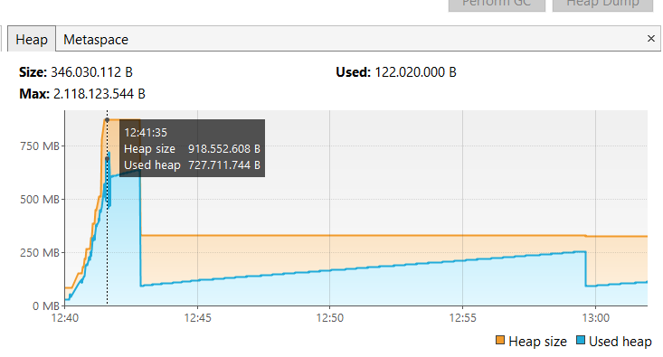

# request-scope-bean-poc
POC based on an ideia to improve code development agility and decoupling by removing AOP code to a lib while sharing 
information through Request Scope Beans

## Introduction
This repository main purpose is to verify the viability to create Spring Beans with _request_ SCOPE, allowing the lib 
users to add a Pre and Pos processing into a REST _Controller_ or a specific endpoint. 
It will be considered a well successfully POC (proof of concept) if the API consuming the library passes in performance
tests and no data leak occur between requests

## Tests

In the first test, when performing 30,000 _requests_ without using the lib, the application had a peak in **heap** usage with
with 150MB in size and 137MB in usage, which represents 84.6%.

In the second test, already using the lib, the amount of memory allocated to the **_heap_** space grew by around 6 times
and usage represented, at the peak of requests, 79.1% (918MB allocated and 727MB consumed)

## Conclusion

The amount of memory allocated when using the lib was too high to consider it a good solution. It gets worrying when the
object considered only has 3 fields typed as **Object** but two of them are set as **Strings**.

The tendency here is a more complex object with more complex child objects needing more memory, what would probably make 
your app scale or crash depending on the environment using it. 

That being said you can use a similar solution with APIs that you know for sure that is not request intensive. 
Although I would not recommend to use it with high intensive requests APIs.

## Sources

- _Visited:_ 2025-01-05 - [Quick Guide to Spring Bean Scopes](https://www.baeldung.com/spring-bean-scopes)
- _Visited:_ 2025-01-05 - [Bean Scopes](https://docs.spring.io/spring-framework/reference/core/beans/factory-scopes.html)