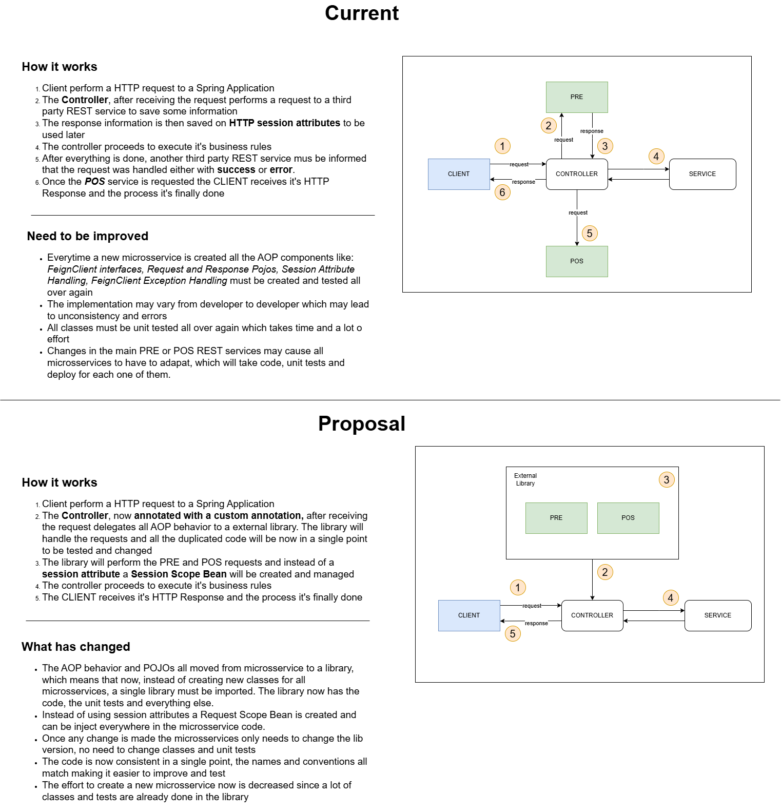

# request-scope-bean-poc
POC based on an ideia to improve code development agility and decoupling by removing AOP code to a lib while sharing 
information through Request Scope Beans

## Introduction
This repository main purpose is to verify the viability to create Spring Beans with _request_ SCOPE, allowing the lib 
users to add a Pre and Pos processing into a REST _Controller_ or a specific endpoint. 
It will be considered a well successfully POC (proof of concept) if the API consuming the library passes in performance
tests and no data leak occur between requests

## Tests

## Conclusion